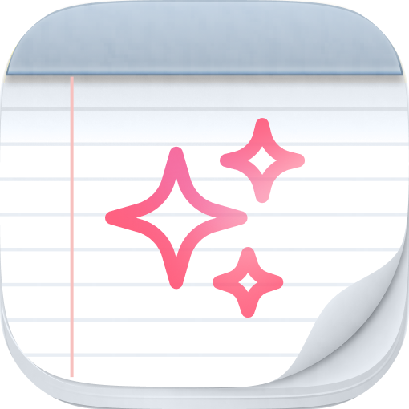

<p align="center">
  
</p>

<h1 align="center">Mentra Notes</h1>

<p align="center">
  <strong>All-day transcription and AI-powered notes for smart glasses</strong>
</p>

<p align="center">
  Captures your conversations throughout the day. Generates structured notes on demand.<br/>
  Always listening. Never forgetting.
</p>

<p align="center">
  <a href="https://apps.mentra.glass/package/com.mentra.notes">Install from Mentra MiniApp Store</a>
</p>

---

## What It Does

Mentra Notes continuously transcribes your conversations through smart glasses and lets you generate AI-powered summaries, search your day, and chat with your transcripts.

- **All-day transcription** — Continuously captures speech via MentraOS glasses
- **AI note generation** — Summarize any time range into structured notes
- **Manual notes** — Create and edit notes directly
- **AI chat** — Ask questions about your transcripts and notes
- **Real-time sync** — State syncs instantly across devices via WebSocket
- **Persistent storage** — MongoDB persistence for transcripts and notes

## Getting Started

### Prerequisites

1. Install MentraOS: [get.mentraglass.com](https://get.mentraglass.com)
2. Install Bun: [bun.sh](https://bun.sh/docs/installation)
3. Set up ngrok: `brew install ngrok` and create a [static URL](https://dashboard.ngrok.com/)

### Register Your App

1. Go to [console.mentra.glass](https://console.mentra.glass/)
2. Sign in and click "Create App"
3. Set a unique package name (e.g., `com.yourName.notes`)
4. Enter your ngrok URL as "Public URL"
5. Add **microphone** permission

### Run It

```bash
# Install
git clone <repo-url>
cd Mentra-Notes
bun install
cp env.example .env

# Configure .env with your credentials
# PACKAGE_NAME, MENTRAOS_API_KEY (required)
# GEMINI_API_KEY or ANTHROPIC_API_KEY (at least one - powers AI features)
# MONGODB_URI (optional - for persistence)

# Start
bun run dev

# Expose via ngrok
ngrok http --url=<YOUR_NGROK_URL> 3000
```

## Documentation

- [MentraOS Docs](https://docs.mentra.glass)
- [Developer Console](https://console.mentra.glass)

## License

MIT